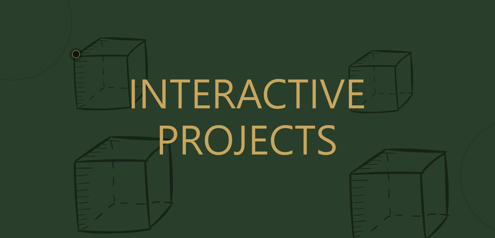

# Interactive Web Project

HTML, CSS 및 JavaScript를 활용하여 동적 효과와 사용자 상호작용을 만들어내는 대화형 웹 디자인의 프로젝트입니다.

## 목차
- 설명
- 기능
- 사용법
- License

## 설명
이 프로젝트는 HTML 파일 (index.html), CSS 파일 (index.css), 그리고 HTML 파일 내에 포함된 JavaScript 코드로 구성되어 있습니다. 사용자 상호작용을 강화하는 커스텀 커서, 프리로더 애니메이션, 헤더 애니메이션 및 포스터 패럴랙스 효과와 같은 요소를 포함하는 대화형 웹 경험을 제공합니다.

## 기능
#### 1. Custom Cursor
 웹페이지에는 사용자 상호작용에 따라 모양이 변하는 커스텀 커서가 포함되어 있습니다.
#### 2. Preloader Animation
 "Hold" 버튼을 클릭하면 프리로더 애니메이션이 활성화됩니다. 애니메이션이 진행됨에 따라 프리로더가 축소되고 페이드 아웃되어 본문이 나타납니다.
#### 3. Header Animation
 헤더 섹션에는 사용자의 마우스 이동에 따라 텍스트가 움직이고 원과 큐브 이미지가 변형되는 동적 애니메이션이 포함되어 있습니다.
#### 4.Poster Parallax
 포스터 섹션에는 이미지가 마우스 이동에 반응하여 약간 움직이는 패럴랙스 효과가 포함되어 있어 시각적 경험을 향상시킵니다.

## 사용법
이 프로젝트를 사용하려면:

1. 저장소를 클론하거나 다운로드하여 로컬 머신에 다운로드합니다.
2. 웹 브라우저에서 index.html 파일을 엽니다.
3. 마우스 커서를 움직이고 프리로더 버튼과 상호작용하여 대화형 요소를 탐색합니다.
## 전체 이미지

## 로그 요약
v1. project upload
## 코드 관리자
fkwmqpfl01

## License
MIT License

